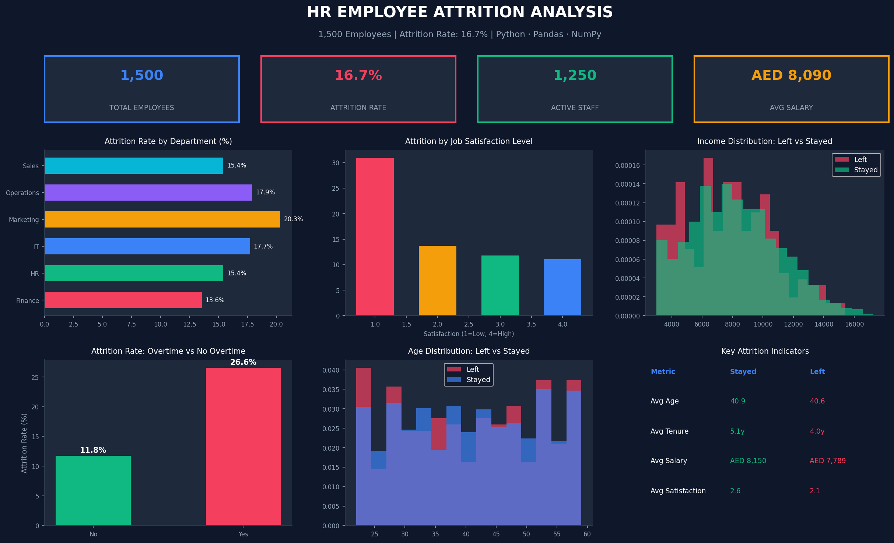

# HR Employee Attrition Analysis

*Tools:* Python · Pandas · NumPy · Matplotlib

## Overview
Analyzed 1,500 employee records to identify key attrition
drivers including job satisfaction, overtime, salary, and
tenure. Segmented workforce by risk level to support HR
decision-making and retention strategies.

## Key Results
- Identified overall attrition rate of *16.7%*
- Overtime employees churn *2x more* than non-overtime
- Low satisfaction (Level 1) shows *30.9%* attrition rate
- Marketing department has highest attrition at *20.3%*

## Dashboard Preview

## Analysis Includes
- Attrition rate by department
- Job satisfaction vs attrition correlation
- Income distribution — left vs stayed
- Overtime impact on attrition
- Age distribution analysis
- Key attrition indicators table

## Files
- hr_attrition_analysis.py — Full Python analysis script
- hr_attrition_data.csv — Employee dataset (1,500 records)

## How to Run
1. Download hr_attrition_analysis.py
2. Run: python hr_attrition_analysis.py
